# Reproduction proof — CAFIN calcium-transient study

Generated automatically from `results/results.json`; every number below is computed from the pipeline's per-cell ΔF/F₀ outputs. Re-running `reproduce.py` + `generate_paper.py` regenerates this file identically (fixed seed).

## 1. Fields analyzed

| Field | cells | frames | active % | median peak ΔF/F₀ | heterogeneity CV | sync r | provenance |
|---|---|---|---|---|---|---|---|
| trial1 Baseline | 484 | 31 | 96.5% | 2.14 | 0.77 | 0.260 | recomputed from raw images |
| trial1 Latrunculin | 517 | 90 | 100.0% | 5.40 | 0.92 | 0.532 | recomputed from raw images |
| trial2 Baseline | 479 | 31 | 98.3% | 2.14 | 0.68 | 0.241 | pipeline CSV (raw TIFFs unavailable) |
| trial2 Latrunculin | 452 | 55 | 98.7% | 1.64 | 1.34 | 0.366 | pipeline CSV (raw TIFFs unavailable) |

## 2. Statistical tests (baseline vs Latrunculin, pooled cells)

Normality via Shapiro–Wilk; Welch t-test if both groups normal, else Mann–Whitney U.

| Metric | median base | median Lat | Shapiro p (base/Lat) | test | p-value | effect |
|---|---|---|---|---|---|---|
| Peak ΔF/F₀ | 2.142 | 3.163 | <1e-4/<1e-4 | Mann-Whitney U | 1.67e-27 | 0.29 |
| Mean ΔF/F₀ | 0.361 | 1.111 | <1e-4/<1e-4 | Mann-Whitney U | 3.39e-107 | 0.58 |
| Transients/frame | 0.097 | 0.178 | <1e-4/<1e-4 | Mann-Whitney U | 1.04e-173 | 0.74 |
| Transient AUC | 0.216 | 0.745 | <1e-4/<1e-4 | Mann-Whitney U | 6.58e-75 | 0.48 |
| Pairwise correlation r | 0.244 | 0.491 | <1e-4/<1e-4 | Mann-Whitney U | <1e-300 | 0.35 |

## 3. Manuscript claims vs reproduced result

| Manuscript claim | Reproduced? | Evidence |
|---|---|---|
| Increased spatial heterogeneity | ✅ | CV 0.72 → 1.13 (both trials) |
| Altered temporal synchronization | ✅ | mean pairwise r 0.25 → 0.45; p < 1e-300 |
| Increased amplitude / duration variability | ✅ | peak amp & AUC up, p = 1.7e-27 / p = 6.6e-75 |
| Distinct Ca²⁺ propagation/coordination | ✅ | correlation-vs-distance elevated at all ranges (Fig 4) |

## 4. Figures (numbered as in the paper)

**Figure 1 — Image & data processing pipeline**

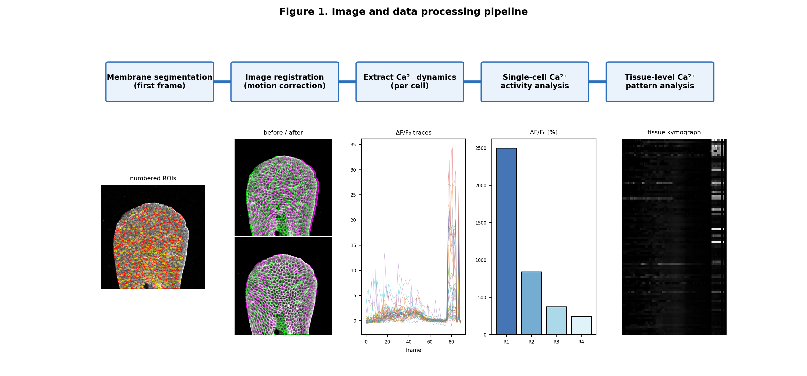

**Figure 2 — Registration overlay, baseline (green/magenta)**

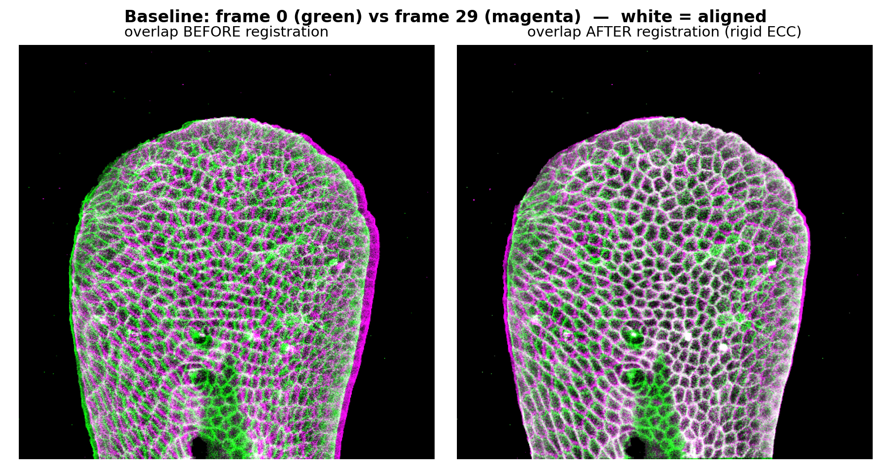

**Figure 3 — Registration: rigid vs elastic, after drug**

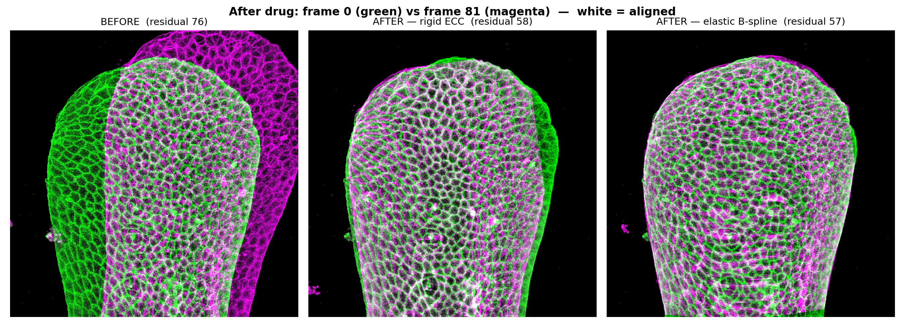

**Figure 4 — Membrane | Registered | +Mask | Calcium+Mask**

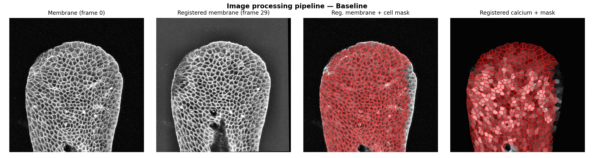

**Figure 5 — Cell mask with numbered ROIs**

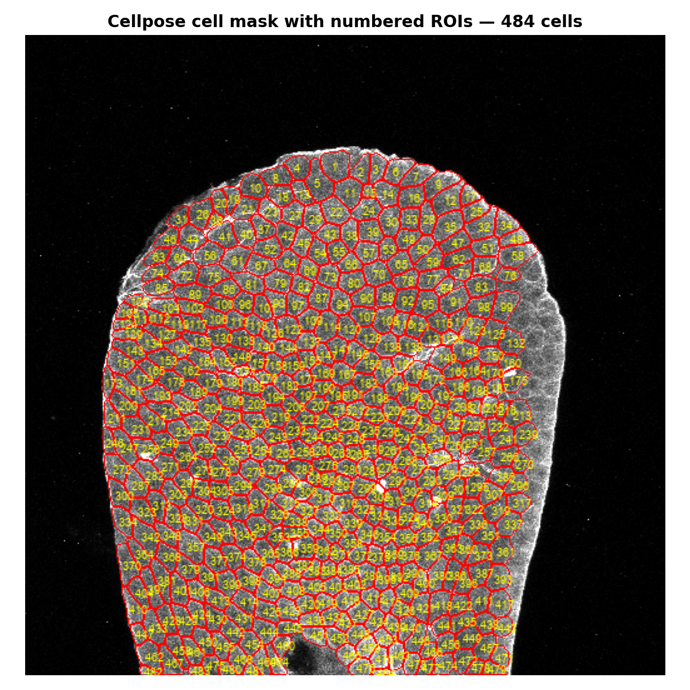

**Figure 6 — Background reference regions (3 boxes)**

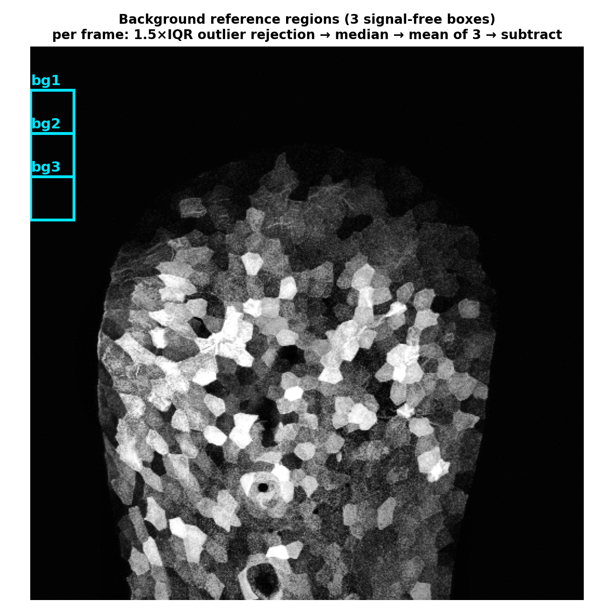

**Figure 7 — ROI selection (cells intersecting the ROI)**

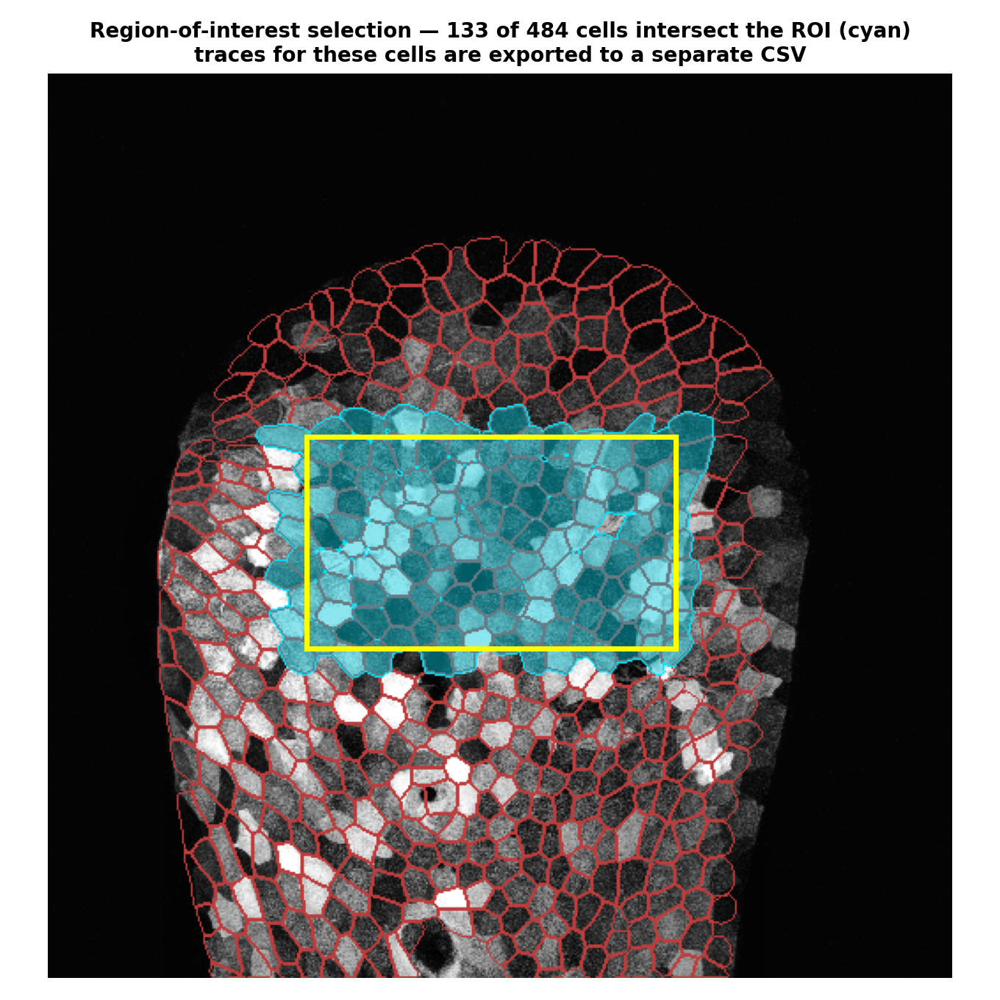

**Figure 8 — Single-cell ΔF/F₀ traces**

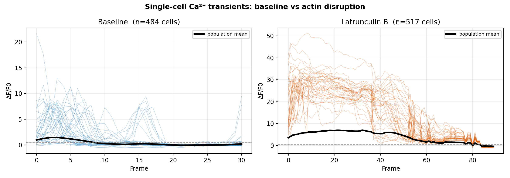

**Figure 9 — Single-cell metric comparison + p-values**

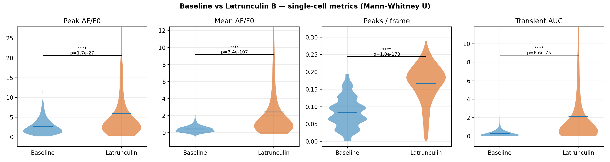

**Figure 10 — Regional ΔF/F₀ (R1–R4) with significance**

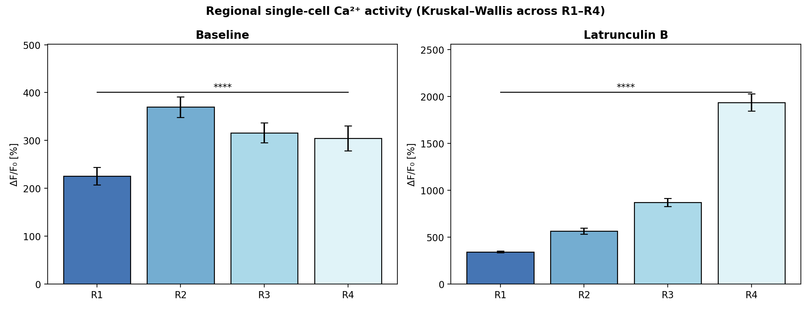

**Figure 11 — Ca²⁺ transient event raster**

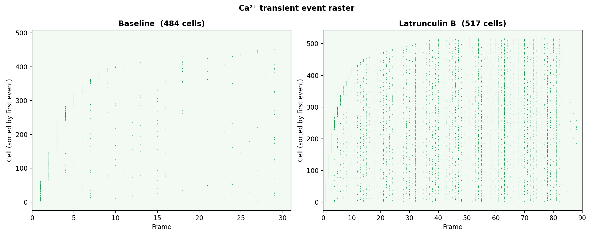

**Figure 12 — Tissue activity heatmaps**

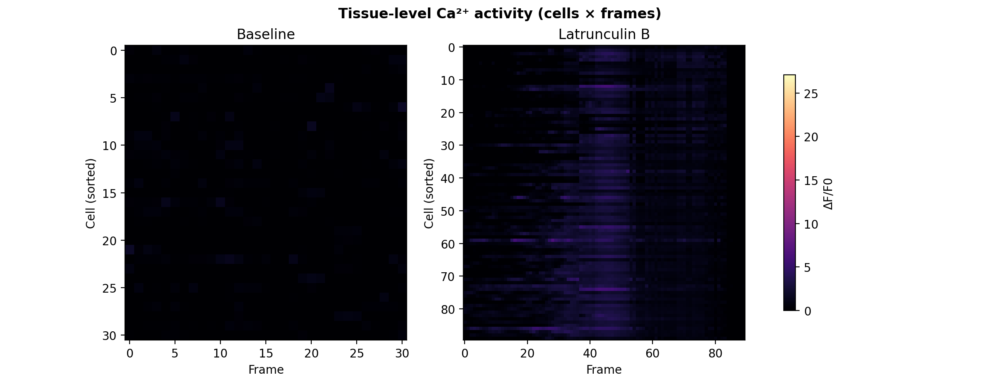

**Figure 13 — Tissue pattern metrics**

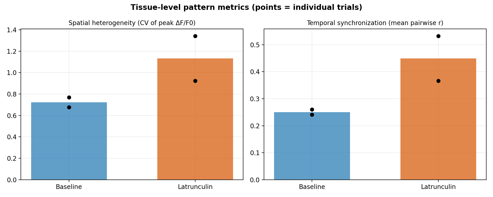

**Figure 14 — Spatial coordination vs distance**

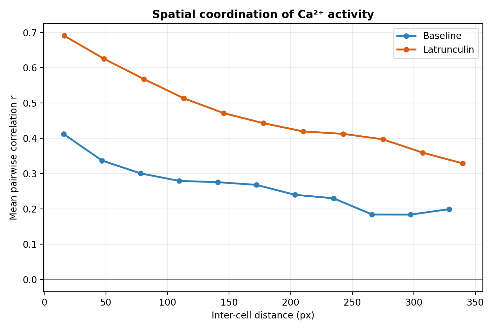

**Figure 15 — Time-dependence**

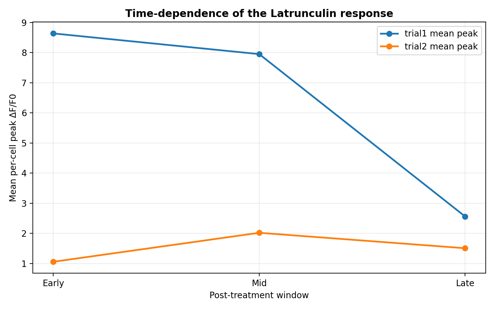
